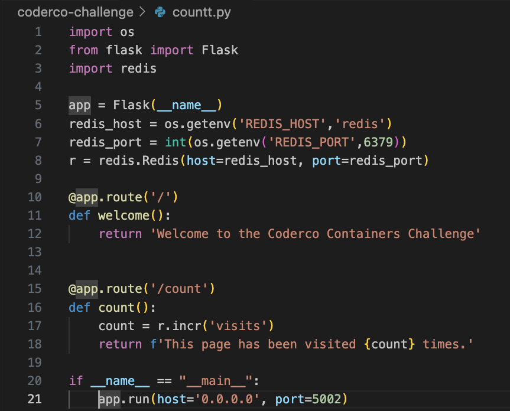
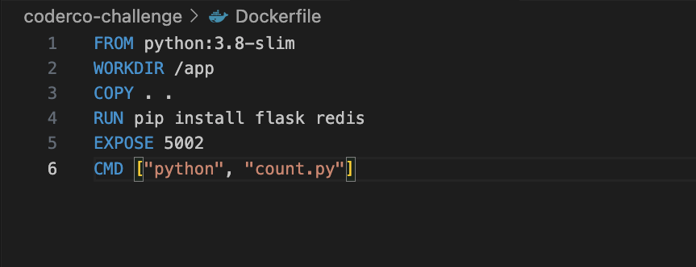
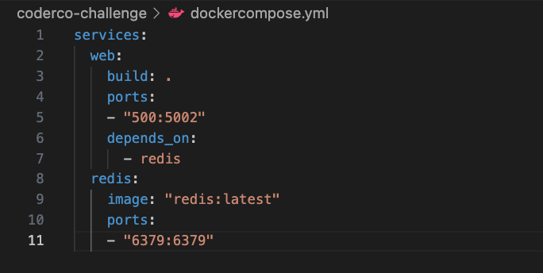
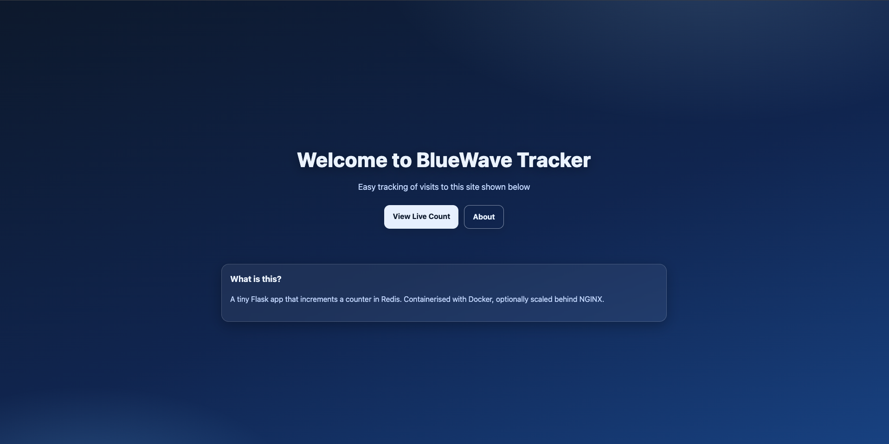
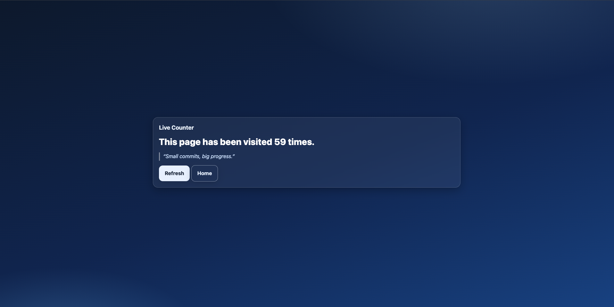
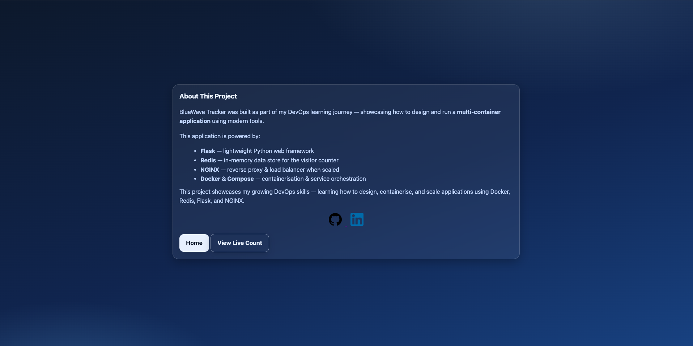

# BlueWave Tracker 🌊 

  

This straightforward web application demonstrates **container orchestration with Docker and Docker Compose**, featuring three services: 

   

- **Flask** → backend web server   

- **Redis** → storage and tracking of visit counts   

- **Nginx** → load balancer and reverse proxy  

 

Each service runs in its own container and communicates via a Docker network. 

  

--- 

  

## Step 1 – Project Setup 

  

I started with a simple Flask app (`count.py`) with two routes:   

- `/` → welcome page   

- `/count` → increments and shows visitor count stored in Redis   

  

The Redis client was configured to connect to the Redis service by name (`redis`) on its default port (`6379`).   

  

 

 

  

The `Dockerfile` defined how to build and run the app:   

- Used a slim Python base image   

- Copied in the app files   

- Installed dependencies (Flask + Redis)   

- Exposed port `5002` 

 

 

 

--- 

  

## Step 2 – Using Docker Compose 

  

`docker-compose.yml` allowed me to run multiple services together on a shared network.   

  

Flask depended on Redis, ensuring the app only started once the database was running.   

 

 

 

To build and start everything:   

`docker compose up --build` 

--- 

 

## Step 3 – Improvements 

  

### Data Persistence 

At first, every time I stopped or restarted the container, the counter reset back to zero.   

To solve this, I added a **Docker volume** to Redis so that the data is stored on the host machine instead of inside the temporary container.   

  

`volumes: 

  - redis-data:/data` 

Now, even if the container stops or is rebuilt, Redis can reload the saved data from the mounted volume. 

This makes the counter reliable and simulates how persistence would work in a real production setup. 

  

## Environment Variables 

Originally, the Redis connection details (host and port) were hardcoded directly into the Python app. 

I changed this so the app reads those values from environment variables, which are defined in docker-compose.yml. 

  

This has a few advantages: 

Keeps sensitive or changeable values out of the source code  

Makes it easier to adapt the app across environments (e.g., dev, staging, production) 

Protects the code from accidental edits when updating configuration 

  

This small change makes the project much more flexible and production-friendly. 

  

 

## Scaling with NGINX 

I added **NGINX** to the project as a reverse proxy and load balancer.   

The goal wasn’t because this app needed it, but to learn how scaling works in real-world environments where applications handle heavier traffic. 

  

In `docker-compose.yml`, I defined an `nginx` service using the `nginx:latest` image, set it to listen on port `5002`, and mounted a custom `nginx.conf` file to manage routing. 

  

To test scaling, I ran: 

`docker compose up --build --scale web=3` 

 

This created three Flask containers, and NGINX distributed traffic across them. 

It was a simple way to see how load balancing makes an application more resilient and closer to production setups. 

 

--- 

 

## Finally adding a Frontend Touch  

To polish the project, I added: 

A gradient-styled homepage with a centred hero 

A counter page that shows a random quote on refresh 

An about page explaining the stack 

Clickable GitHub + LinkedIn icons 

 

## Final UI Screenshots 

  

 

  

 

  

 
